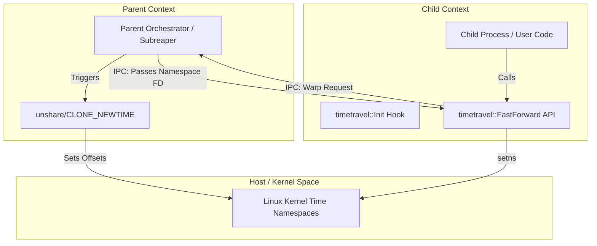
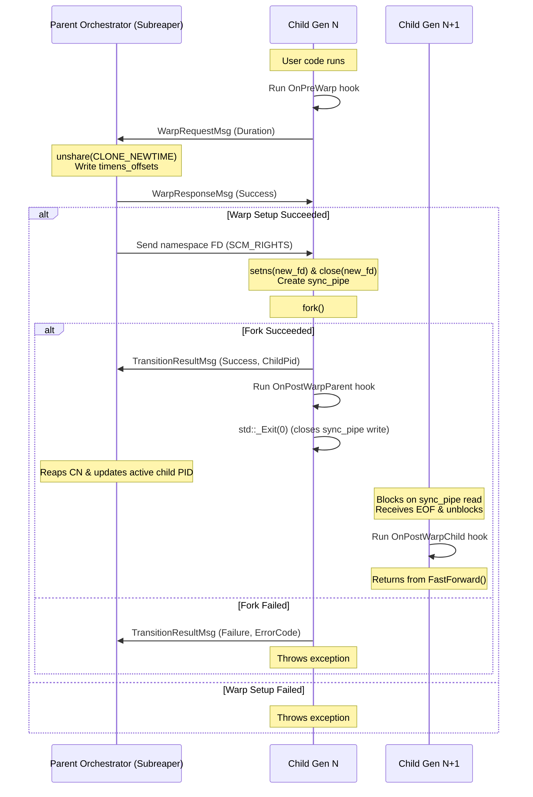

# OmniTimeTravel: Architecture and Design Specifications

This document outlines the internal design, architecture, and implementation details of **OmniTimeTravel** (`omni-timetravel`), a C++23 library designed to provide precise, zero-overhead time-manipulation and fast-forwarding capabilities for applications (such as integration test suites) using Linux Time Namespaces.

---

## 1. Architectural Overview

Unlike user-space time-interception libraries (such as `LD_PRELOAD` wrappers over `clock_gettime`), **OmniTimeTravel** virtualizes `CLOCK_MONOTONIC` and `CLOCK_BOOTTIME` at the Linux kernel boundary. This ensures that:
- Raw system calls (such as direct `syscall(SYS_clock_gettime, ...)` or Go/Rust runtimes bypassing libc) are shifted natively.
- Zero runtime overhead is introduced during normal clock lookups.
- Complete compatibility is maintained with standard cooperative libraries like `omni-fiber` and Boost.Asio.



### Scope & Constraints
- **Clock Support**: Virtualizes `CLOCK_MONOTONIC` and `CLOCK_BOOTTIME`. It does not shift `CLOCK_REALTIME` (wall clock time).
- **Environment**: Requires Linux kernel 5.6+ with `CONFIG_TIME_NS=y` enabled.
- **Privileges**: The parent process must have appropriate capabilities (e.g. `CAP_SYS_ADMIN`) or run in an environment where unprivileged user namespaces allow namespace creation (`/proc/sys/user/max_time_namespaces`).

---

## 2. Core Linux Kernel Invariants

To manipulate a process's perception of time, the library works around two kernel rules:

1. **Immutability of Namespace Offsets**: The offsets (`timens_offsets`) of a time namespace are immutable once a process has entered that namespace or spawned children inside it.
2. **Delayed Association**: Calling `setns(fd, CLONE_NEWTIME)` does not update the time namespace of the calling process itself. It only updates the `time_for_children` namespace, meaning that the new time offsets will only apply to future children spawned via `fork()` or `clone()`.

---

## 3. Stop-Warp-Continue Model

To allow a running process to perceive advanced time offsets without restarting the program (which would reset the heap, stack, and active connections), the library implements the **Stop-Warp-Continue** model.

### 3.1 Bootstrap Phase (Spawning Child Gen 1)

Before any time travel warps can occur, the process lifecycle is bootstrapped within a single executable program:
1. **Application Launch**: The program starts. Inside `main()`, it checks for the presence of the environment variable `OMNI_TIMETRAVEL_IS_CHILD`.
2. **Orchestrator Role (Parent)**: If the variable is not set, the process instantiates the `Orchestrator` and calls `orchestrator.Run(argv)`.
3. **IPC Preparation & Timeout Configuration**: The orchestrator creates a Unix domain socket pair via `socketpair(AF_UNIX, SOCK_STREAM, 0, sv)` to establish a control channel. Sockets are configured with a 5-second timeout (`SO_RCVTIMEO` / `SO_SNDTIMEO`) to prevent deadlocks in case of hanging processes.
4. **Dual Fallback Namespace unshare Strategy**:
   - The orchestrator first attempts `unshare(CLONE_NEWTIME)` directly (which works if the orchestrator runs as root or has `CAP_SYS_ADMIN`).
   - If direct unshare fails with `EPERM`, it falls back to `unshare(CLONE_NEWUSER | CLONE_NEWTIME)` to create a user-namespace mapping. It writes deny to `/proc/self/setgroups` and maps the UID/GID (`uid_map`, `gid_map`) so the orchestrator retains owner access to file descriptors.
5. **Subreaper & Initial Namespace**: The orchestrator registers itself as a subreaper (`PR_SET_CHILD_SUBREAPER`), and writes starting offsets `monotonic 0 0` and `boottime 0 0` to `/proc/self/timens_offsets`.
6. **Forking Child Gen 1**: The orchestrator sets the role flag `OMNI_TIMETRAVEL_IS_CHILD=1` and the descriptor identifier `OMNI_TIMETRAVEL_SOCKET_FD=sv[1]` in the environment. It then calls `fork()`. The child of the fork is born directly inside the initial time namespace.
7. **Child Gen 1 Re-Exec**: To avoid fork-racing problems, the child process immediately calls `execv("/proc/self/exe", argv)` (self-exec). This restarts the program as a clean, single-threaded child process image. Because the socket file descriptor `sv[1]` does not have `FD_CLOEXEC` set, it remains open and is inherited across the re-exec boundary.
8. **Client Role (Child)**: The re-executed child enters `main()`, detects `OMNI_TIMETRAVEL_IS_CHILD=1`, and branches to the client role. It instantiates the `Client` context (which reads `OMNI_TIMETRAVEL_SOCKET_FD` to retrieve the inherited socket) and connects to the orchestrator control socket.

### 3.2 Time Travel Transition (Gen N to Gen N+1)

Once the application is running, time is warped using a robust, synchronous IPC transition protocol:



### Transition Steps:
1. **Pre-Warp Hook**: The child (`Child Gen N`) calls `timetravel::FastForward(duration)`. It first invokes the registered `OnPreWarp` hook, allowing event loops (like Boost.Asio) to suspend activity and prepare for the fork.
2. **Warp Request**: The child writes `WarpRequestMsg` containing the duration to the control socket.
3. **Warp Setup**: The Parent Orchestrator reads the request, calls `unshare(CLONE_NEWTIME)` to create a new time namespace, and writes the target offset to `/proc/self/timens_offsets`.
4. **Warp Acknowledgment**:
   - If setup succeeded, the orchestrator sends a `WarpResponseMsg` with `Success = true`, followed by the namespace file descriptor via `SCM_RIGHTS`.
   - If setup failed, it sends `Success = false`. The client receives this and throws a `std::runtime_error`.
5. **FD Joining & Fork Preparation**: The client reads the namespace descriptor, calls `setns(new_ns_fd, CLONE_NEWTIME)`, and immediately closes it. It then creates a unidirectional synchronization pipe (`sync_pipe`) and calls `fork()`.
6. **Post-Warp Parent Execution (Gen N)**:
   - **On Success**: Sends a `TransitionResultMsg` with `Success = true` and the new PID. It invokes the `OnPostWarpParent` hook, closes the write end of `sync_pipe`, closes the parent socket, and exits immediately via `std::_Exit(0)` to prevent duplicate destructor/atexit executions.
   - **On Failure**: If `setns`, `pipe`, or `fork` fails, it sends `TransitionResultMsg` with `Success = false` and the error code. It then throws a `std::system_error` and resumes execution in the same process without exiting.
7. **Post-Warp Child Execution (Continue - Gen N+1)**:
   - Closes the write end of `sync_pipe` and executes a blocking `read()` on the read end. When `Child Gen N` exits, the kernel closes its write descriptor, causing the `read()` to return `0` (EOF). `Child Gen N+1` then closes the read descriptor, invokes the `OnPostWarpChild` hook (e.g. calling `io_context::notify_fork(boost::asio::fork_child)` to rebuild the event loop), and returns from `FastForward()`.
8. **Subreaper Adoption & Reap**: Since the Parent Orchestrator marked itself as a subreaper, the exit of `Child Gen N` causes `Child Gen N+1` to be reparented directly to the Orchestrator. The Orchestrator reaps the old child via `waitpid`. If the transition failed, the Orchestrator logs the error and continues tracking the active child.

> [!IMPORTANT]
> **Structured Concurrency Warning**:
> Since `fork()` only copies the calling thread, any secondary threads are terminated. This model is suited for single-threaded event loops (such as fiber execution environments running on a single executor thread).

---

## 4. API Specification & Interface

### 4.1 C++ Interface Specifications

To avoid global variables and static state, the library defines dedicated class interfaces for the Parent Orchestrator and the Child Client.

```cpp
#pragma once

#include <chrono>
#include <functional>
#include <optional>

namespace Omni::TimeTravel {

class IWarpListener {
public:
  virtual ~IWarpListener() = default;

  // Invoked in Child Gen N before transitioning.
  virtual void OnPreWarp() {}

  // Invoked in Child Gen N after fork, before exit.
  virtual void OnPostWarpParent() {}

  // Invoked in Child Gen N+1 after fork, before returning from FastForward.
  virtual void OnPostWarpChild() {}
};

class Client {
public:
  // Constructed inside the child process context
  Client();

  ~Client();

  Client(const Client&) = delete;
  Client& operator=(const Client&) = delete;
  Client(Client&&) noexcept;
  Client& operator=(Client&&) noexcept;

  // Move the monotonic clock forward by the given duration
  void FastForward(std::chrono::nanoseconds duration);

  // Register a listener to prepare and recover from fork-based warp transitions
  void RegisterListener(IWarpListener& listener);

private:
  int _SocketFd = -1;  // Inherited Unix domain socket connection to the parent orchestrator
  std::optional<std::reference_wrapper<IWarpListener>> _Listener;
};

class Orchestrator {
public:
  Orchestrator();

  ~Orchestrator();

  Orchestrator(const Orchestrator&) = delete;
  Orchestrator& operator=(const Orchestrator&) = delete;

  // Spawns the child (by forking and re-executing argv) and starts the orchestrator loop.
  // Returns the exit status code of the last active child process.
  int Run(char** argv);

private:
  int _ChildPid = -1;
  int _ControlSocketFd = -1;

  // Track cumulative offsets to apply to new namespaces
  long long _CumulativeMonotonicOffsetNs = 0;
  long long _CumulativeBoottimeOffsetNs = 0;
};

} // namespace Omni::TimeTravel
```

### 4.2 Usage Example

Here is a complete, self-contained runnable example. The program branches immediately to the client or parent role depending on the `OMNI_TIMETRAVEL_IS_CHILD` environment variable.

```cpp
#include <omni-timetravel/TimeTravel.hpp>
#include <iostream>
#include <chrono>
#include <cstdlib>

// Implementation of the warp event listener
class AppWarpListener : public Omni::TimeTravel::IWarpListener {
public:
  void OnPreWarp() override {
    std::cout << "[Child] Pre-warp hook: suspending event loop..." << std::endl;
  }

  void OnPostWarpParent() override {
    std::cout << "[Child] Post-warp parent hook: cleaning up and exiting..." << std::endl;
  }

  void OnPostWarpChild() override {
    std::cout << "[Child] Post-warp child hook: notifying event loop of fork..." << std::endl;
    // e.g. io_context.notify_fork(boost::asio::fork_child);
  }
};

int main(int argc, char* argv[]) {
  // Check if we are running in the child role (environment flag set by parent)
  if (std::getenv("OMNI_TIMETRAVEL_IS_CHILD")) {
    
    // 1. Initialize the client variable on the stack
    std::cout << "[Child] Connecting to parent orchestrator..." << std::endl;
    Omni::TimeTravel::Client timeClient;

    // Register lifecycle listener to notify external components
    AppWarpListener listener;
    timeClient.RegisterListener(listener);

    // 2. Read initial monotonic time
    auto t1 = std::chrono::steady_clock::now();
    std::cout << "[Child] Time before warp: " 
              << std::chrono::duration_cast<std::chrono::seconds>(t1.time_since_epoch()).count() 
              << "s" << std::endl;

    // 3. Trigger a time travel warp of 30 seconds
    std::cout << "[Child] Requesting time warp of 30 seconds..." << std::endl;
    timeClient.FastForward(std::chrono::seconds(30));

    // 4. Read warped monotonic time (runs in Child Gen 2)
    auto t2 = std::chrono::steady_clock::now();
    std::cout << "[Child] Time after warp: " 
              << std::chrono::duration_cast<std::chrono::seconds>(t2.time_since_epoch()).count() 
              << "s" << std::endl;

    return 0;
  }
  
  // Otherwise, start as the parent orchestrator
  std::cout << "[Parent] Initializing orchestrator..." << std::endl;
  Omni::TimeTravel::Orchestrator orchestrator;
  
  // Launch the child process by forking and re-executing this binary
  std::cout << "[Parent] Spawning child process..." << std::endl;
  
  int exitCode = 1;
  try {
    exitCode = orchestrator.Run(argv);
  } catch (const std::exception& e) {
    std::cerr << "[Parent] Orchestrator error: " << e.what() << std::endl;
  }
  std::cout << "[Parent] Last child exited with code: " << exitCode << std::endl;
  return exitCode;
}
```

---

## 5. Windows Implementation (Microsoft Detours)

On Windows, Linux time namespaces and native `fork()` are not available. To achieve identical external behavior and maintain API compatibility, `omni-timetravel` implements Windows support via Microsoft Detours.

### 5.1 Architecture Overview (Windows)

Instead of isolating time offsets at the OS kernel namespace boundary, the Windows implementation intercepts time-query APIs in user space within the child process:

- **Hooked APIs**:
  - `QueryPerformanceCounter` (used by `std::chrono::steady_clock` under MSVC STL)
  - `GetTickCount`
  - `GetTickCount64`
- **Offset Storage**: Global atomic offsets `g_QpcOffset` and `g_MsecOffset` are updated during `FastForward()` calls.
- **Process Model**: There is no fork. The client process updates the offsets in-place and runs in a single process context.

### 5.2 Process Orchestration (Windows)

To match the Linux orchestrator execution pattern, the parent-child structure is preserved:

1. **Bootstrap**:
   - `Orchestrator::Run` is called in the parent process.
   - It sets environment variables `OMNI_TIMETRAVEL_IS_CHILD=1` and `OMNI_TIMETRAVEL_SOCKET_FD=1` (dummy value).
   - It spawns the child process via `CreateProcessA` using the same arguments as `argv`, and blocks waiting for it to exit via `WaitForSingleObject`.
2. **Client Initialization**:
   - Inside the child process, the `Client` constructor detects `OMNI_TIMETRAVEL_SOCKET_FD` in the environment.
   - It initializes Detours transactions to attach hooks to `QueryPerformanceCounter`, `GetTickCount`, and `GetTickCount64`.
3. **Time Warping**:
   - Calling `FastForward(duration)` validates that the client is initialized, invokes `OnPreWarp()`, converts the duration to QPC ticks (using `QueryPerformanceFrequency`) and milliseconds, adds the calculated values to the global offsets, and invokes `OnPostWarpChild()`.
4. **Cleanup**:
   - On `Client` destruction, the detours hooks are detached and offsets are reset.
